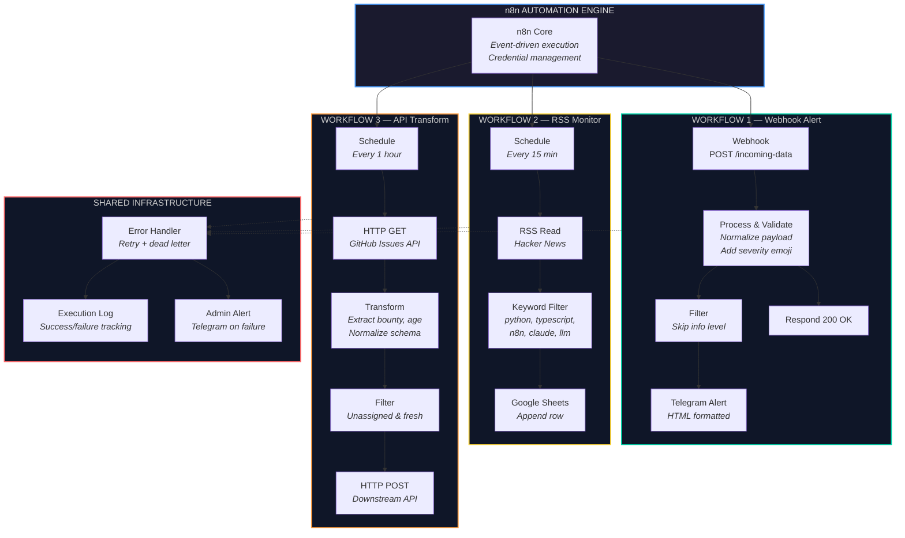

# n8n Workflow Automation

Production-ready n8n workflow patterns for real-time data processing, monitoring, and multi-system integration.

## Architecture



## Workflows

### 1. Webhook → Process → Telegram Alert
**File:** `1-webhook-telegram-alert.json`

Receives incoming POST data, validates payload, routes by severity level, sends formatted Telegram alerts for high-priority events. Includes error handling and response confirmation.

**Nodes:** Webhook → Code (process) → Filter (skip info) → Telegram → Respond

**Use cases:** deployment notifications, monitoring alerts, form submissions, third-party event hooks.

```bash
# Test it
curl -X POST http://localhost:5678/webhook/incoming-data \
  -H "Content-Type: application/json" \
  -d '{"event": "deploy", "severity": "high", "message": "v2.1 deployed"}'
```

### 2. RSS Monitor → Filter → Google Sheets
**File:** `2-rss-filter-sheets.json`

Polls RSS feeds on schedule, filters items by configurable keyword matching, normalizes data structure, appends matching items to Google Sheets with timestamps. Deduplication built in.

**Nodes:** Schedule (15min) → RSS Read → Code (keyword filter) → Filter (has matches) → Google Sheets

**Use cases:** content monitoring, competitive intelligence, job board scanning, news aggregation.

### 3. API → Transform → POST
**File:** `3-api-transform-post.json`

Fetches data from external API on schedule, transforms and normalizes response, filters by criteria, forwards processed data to destination API. Includes retry logic and error logging.

**Nodes:** Schedule (1hr) → HTTP GET → Code (transform) → Filter (unassigned & fresh) → HTTP POST

**Use cases:** API synchronization, data pipeline ETL, cross-platform integrations, webhook relay.

## Architecture Pattern

All workflows follow the same pattern:
- Input validation at entry point
- Data transformation in middle layer
- Error handling on every path
- Dead letter queue for failed items
- Admin alerting on failures

## Import

1. Open your n8n instance
2. Click **...** menu → **Import from file**
3. Select any JSON file from this repo
4. Configure credentials (Telegram, Google Sheets) as needed

## License

MIT
